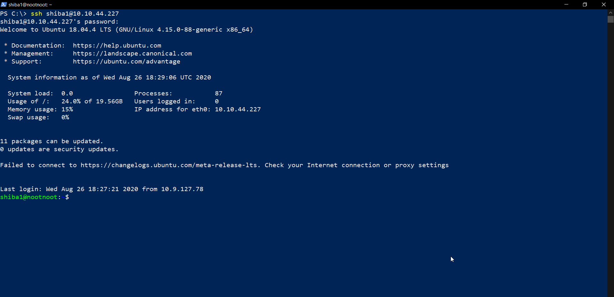
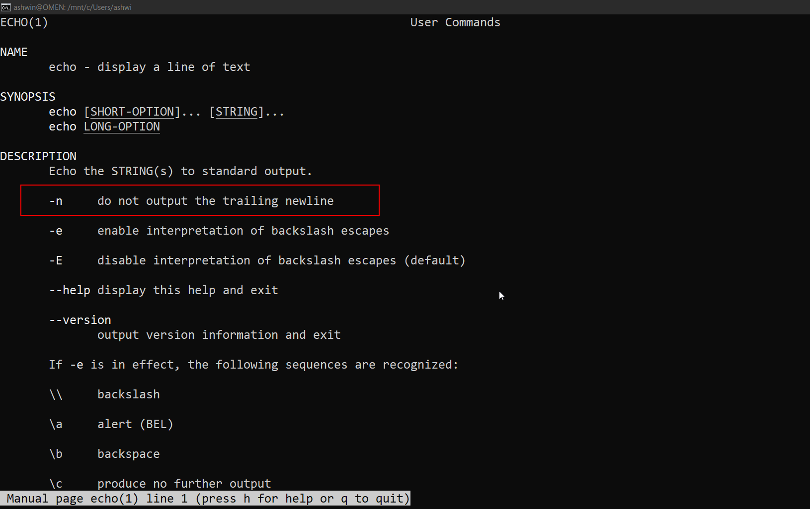
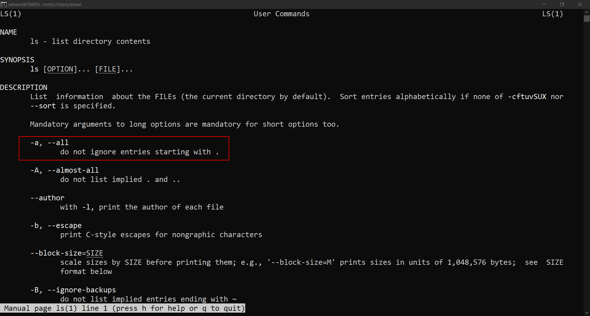
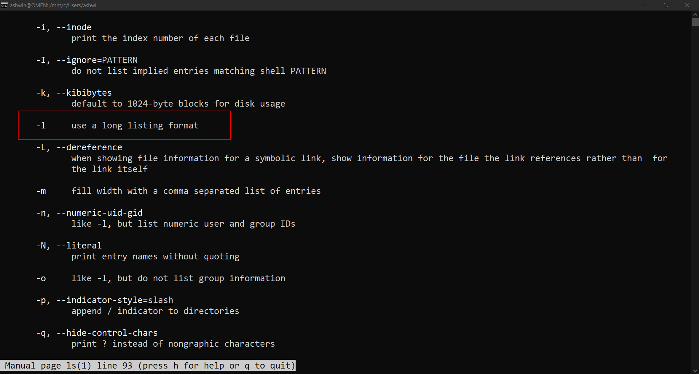
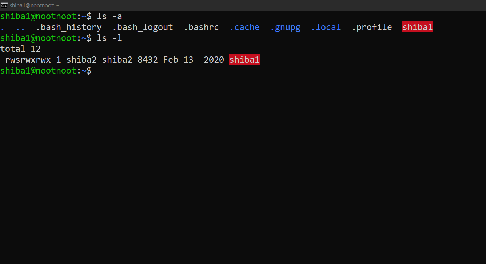
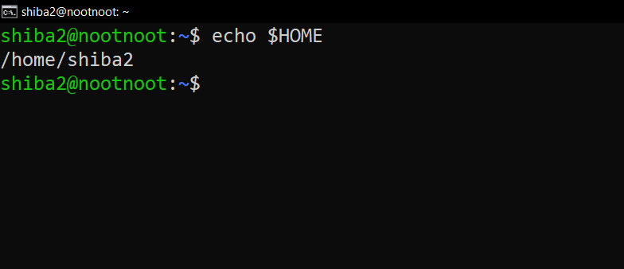

# TRYHACKME - LEARN LINUX WRITEUP
Writeup of Learn Linux room in tryhackme.com
Try out the room [here](https://tryhackme.com/room/zthlinux) if you haven't!!

## LEARN LINUX
"The future belongs to Linux/Unix"

### TASK 1
Deploy the Machine - Just click on the Deploy Button.

### LOGGING IN TO THE DEPLOYED MACHINE
When the machine  is deployed, you will recieve the `MACHINE_IP`.

Code for remote access using SSH:

`ssh <username>@<hostname>`

Now we have to log into the deloyed machine. I will be showing the way it can be done using Powershell and Bash(with the Screenshots).

The code is the same:

`ssh shiba1@<MACHINE_IP>`

Password : shiba1

- ##### USING POWERSHELL

Open Powershell and perform the above code and input the password.

- #### USING BASH

Open Bash Terminal and prform the above code and input the password.

!(ssh using bash)[tryhackme_linuxssh.png]

### TASK 6 - Manual Pages and Flags

The answer is given in the task description. You should also check the man page of echo. I will include the screenshot too.

`man echo`

Press `q` to exit the man page

> Question : How would you output hello without a newline
Answer : `echo -n hello`

### TASK 7 - `ls`

Check the man page.

`man ls`

> \# 1 : What flag outputs all entries

Answer : `-a`

> \# 2 : What flag outputs things in a "long list" format

Answer : `-l`

### TASK 8 - `cat`

Check the man page.

`man cat`

> \# 1 : What flag numbers all output lines?

Answer: `-n`

### TASK 10 - Running A Binary

Keep this table always in mind to get a clarity about ~Absolute~ and ~Relative Paths~.

> \#1 : How would you run a binary called hello using the directory shortcut . ?

Answer : `./hello`

> \#2 : How would you run a binary called hello in your home directory using the shortcut ~ ?

Answer : `~/hello`

> \#3 : How would you run a binary called hello in the previous directory using the shortcut .. ?

Answer : `../hello`

### TASK 11 - Binary - Shiba1

As it is taught in the previous task description. This is just the application part.

> \#1 : What's the password for shiba2

Answer : pinguftw

### TASK 12 - `su`

Here we gotta log in to `shiba2`.

`su shiba2` 

Password : pinguftw

> \#1 : How do you specify which shell is used when you login ? (Refer the man page)

Answer : `-s`

### TASK 14 - `>`

\> is the operator for output redirection.

> \#1 : How would you output twenty to a file called test ?

Answer : `echo twenty > test`

### TASK 18 - `$`

Used to denote environment variables.

> \#1 : How would you set nootnoot equal to 1111 ?

Answer : `export nootnoot=1111`

> \#2 : What is the value of the home environment variable ?

Answer : `/home/shiba2`

